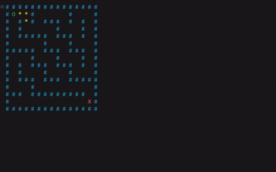

🧭 BFS Maze Pathfinder

 Real-time visualization of Breadth-First Search (BFS) pathfinding in a terminal-based maze 
 
     

🔥 Tagline

“Visualizing shortest-path algorithms, one terminal frame at a time.” ✨

📝 Project Description

This project is a terminal-based maze pathfinding visualizer built using Python and the Curses library.
It demonstrates how the Breadth-First Search (BFS) algorithm explores a maze level by level to guarantee the shortest path from a start point to a destination.

The maze is rendered dynamically in the terminal, allowing users to visually observe:

Visited nodes

Active exploration

Final shortest path discovery

This project is ideal for learning algorithms, debugging pathfinding logic, and showcasing DSA skills in a visual and intuitive way.

🎬 Demo Visualization (GIF)

  

The GIF above demonstrates real-time BFS traversal and shortest-path discovery inside the terminal.

🧠 Key Concepts Demonstrated

Breadth-First Search (BFS)

Queue-based traversal

Shortest path guarantee

Grid-based maze representation

Real-time terminal rendering

Algorithm visualization for learning

🛠 Tech Stack

Python 3.x

Curses (Terminal UI rendering)

Queue (FIFO) for BFS traversal

Data Structures & Algorithms

🎯 Learning Outcomes

Strong understanding of BFS mechanics

Visual intuition of pathfinding algorithms

Experience with terminal-based UI design

Improved debugging through real-time visualization

Hands-on application of queues and graph traversal

👨‍💻 Author

Yash Brahmankar
Passionate about Python, algorithms, and building projects that explain complex ideas visually.

